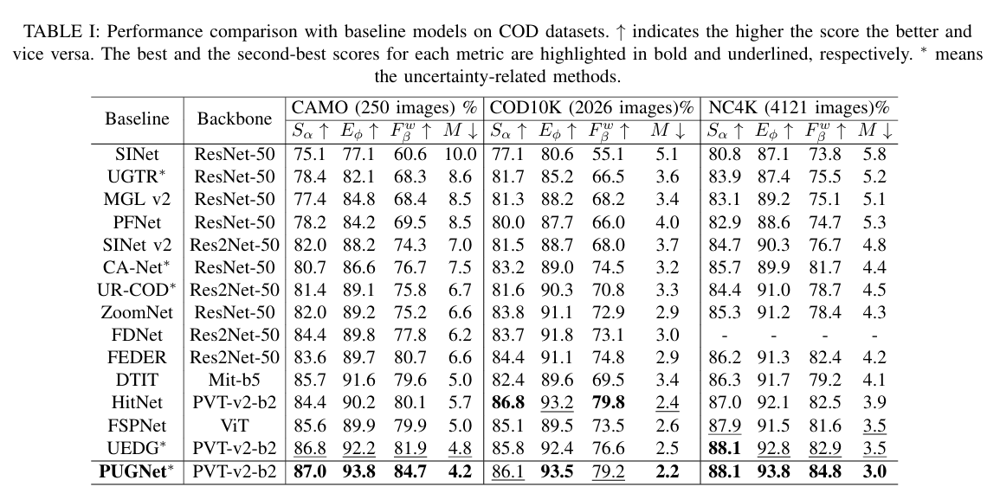
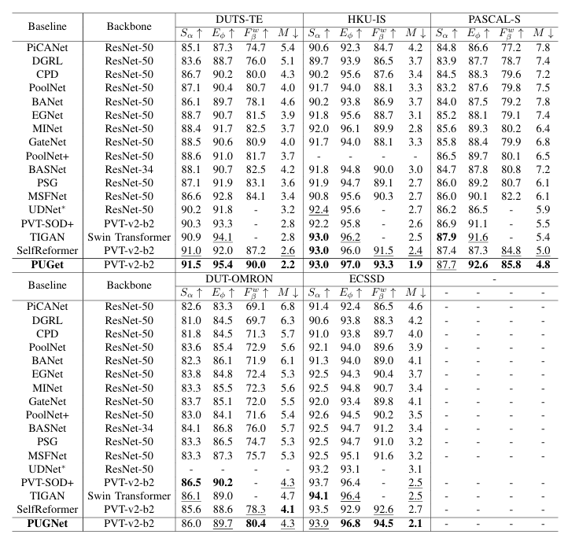
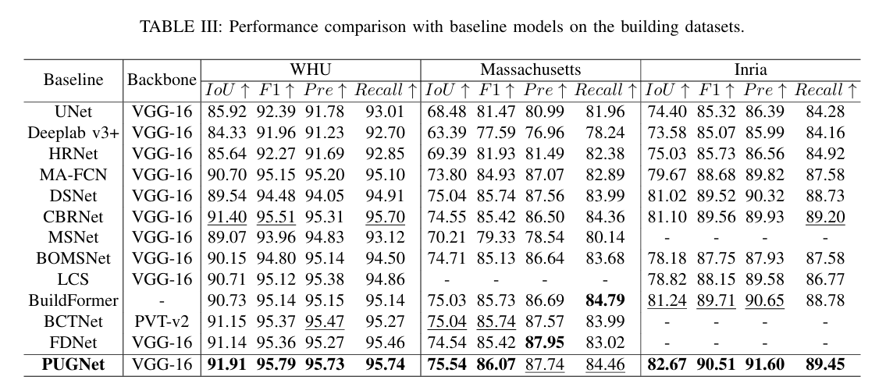

# The official implement of 《Progressive Uncertainty Guided Network for Binary Segmentation》
We will soon provide all the codes and the weights of the trained models

## Performance Comparison on COD Datasets

## Performance Comparison on SOD Datasets

## Performance Comparison on Building Datasets

